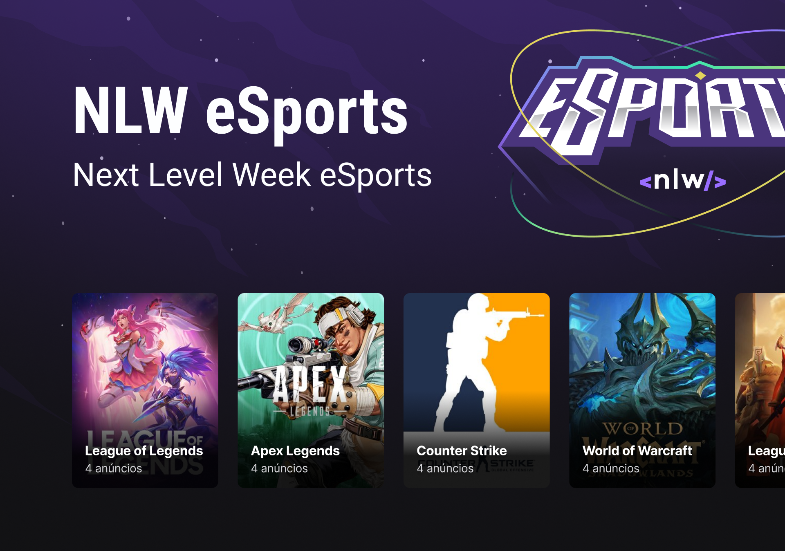

<div align="center">


This application was developed during NLW eSports, made by [Rocketseat](https://rocketseat.com.br/). 🚀

</div>

<div align="center">

[]()
[]()
[]()

[](https://discord.gg/rocketseat)

</div>



## ▶ Preview

[](https://duo-esports.vercel.app/)

## 📃 About

Duo is a platform for gamers to find other gamers to play.

## 🎨 Layout

- [Layout Figma](https://www.figma.com/community/file/1150897317533332617)

## ⚙️ Build with

- [ReactJS](https://reactjs.org/docs/getting-started.html)
- [TypeScript](https://www.typescriptlang.org/docs/)
- [Tailwindcss](https://tailwindcss.com/)
- [NodeJS](https://nodejs.org/en/)
- [Express](https://expressjs.com/pt-br/)
- [Vite](https://vitejs.dev/)

## 💻 Getting started

```sh
git clone https://github.com/xandowski/duo-esports.git && cd duo-esports
```

to run backend:

```sh
cd server
npm install
```

to run frontend:

```sh
cd web
npm install
npm run dev
```

to run mobile

```sh
cd mobile
npm install
expo start
```

## ⚒️ Still in development
